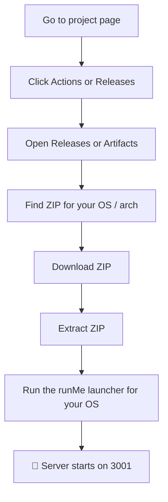
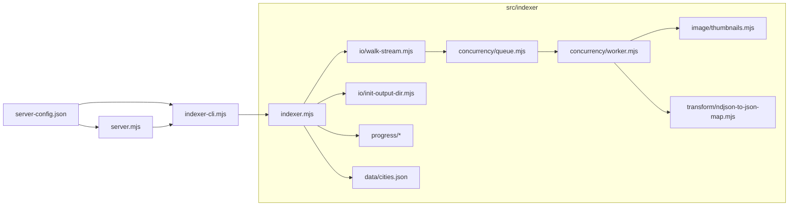
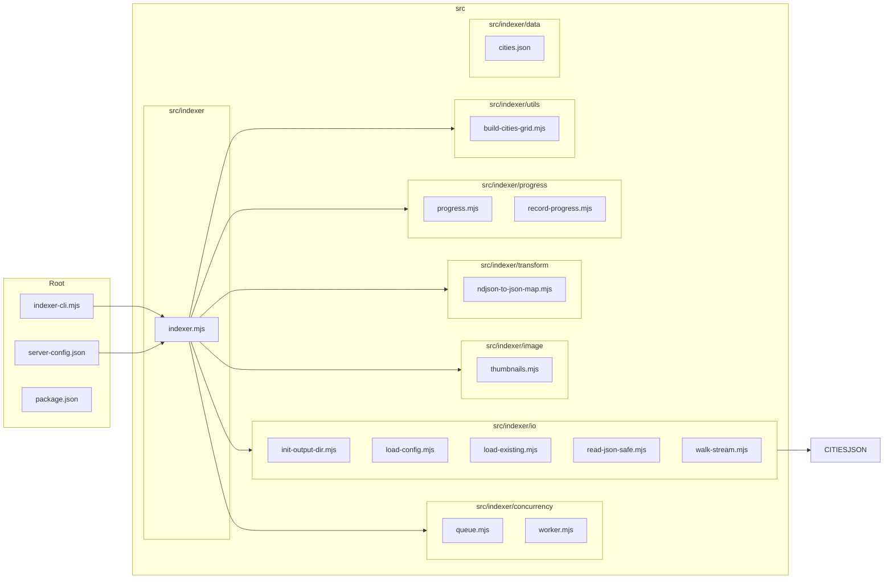

# Albums Google Photos Indexer

[](https://github.com/travel-albums-ai/albums-google-photos-indexer/actions/workflows/release.yml)

A Node.js CLI, library, and local REST server for indexing Google Photos Takeout folders. It scans one or more local roots, writes metadata as NDJSON, and creates thumbnails for browsing and offline analysis.

## TL;DR ⚡️
- Purpose: index local Google Photos Takeout folders into NDJSON + thumbnails.
- Quick run (non-technical): Download the ZIP built by the repository's GitHub Actions (or Releases), extract it, and run the included `runMe` launcher for your OS (Windows: `.cmd` or `.ps1`). No install or configuration required — the bundle contains the runtime and a default config.
- Developer quick-start: `node indexer-cli.mjs --config ./examples/server-config.json` or import `start()` programmatically.

## Simplicity
This project aims to be simple for local use: a single JSON config file, a CLI, and an optional REST server. No cloud credentials are required for typical runs.

## Table of Contents
- [TL;DR](#tl-dr)
- [Simplicity](#simplicity)
- [For Non-Technical Users](#for-non-technical-users)
- [For Technical Users](#for-technical-users)
- [Architecture](#architecture)
- [Requirements](#requirements)
- [Configuration](#configuration)
- [CLI](#cli)
- [Output](#output)
- [REST server](#rest-server)
- [Platform distributions](#platform-distributions)
- [Programmatic usage](#programmatic-usage)
- [Development](#development)

## For Non-Technical Users 👋
This section is for people who just want the app to run — no coding, no Node installs, no config editing.

Quick steps (Windows — easiest):

1. Download the ZIP artifact produced by the repository build (check GitHub Actions artifacts or Releases).
2. Extract the ZIP somewhere you can access (e.g., `C:\TravelAlbums`).
3. Open the extracted folder and look for the `runMe` launcher for your platform:
	- Windows: `*.cmd` (double-click) or `*.ps1` (PowerShell). You can also run the bundled PowerShell launcher from a terminal:

4. The launcher starts the service. It spawns the indexer internally and begins indexing the bundled or default configured paths.

What you don't need to do:
- No installation of Node.js or dependencies.
- No manual editing of JSON config files (defaults in the bundle work out-of-the-box).
- No other tools or services.

Notes for Linux / macOS users: packaged bundles and simple `runMe` scripts for those platforms are available as artifacts as well — see the repository's release artifacts or the `dist-` folders. Full command-line instructions for Linux/macOS are provided in the Developer section below.

#### Quick visual steps (download & run) 🧭



Follow those steps to get the bundled, zero-config release running in a few clicks.

## For Technical Users
The sections below provide complete technical details (architecture, programmatic API, distribution build steps, and developer notes).

## Architecture



The server and CLI run the indexer in the same Bun process. The scanner
walks local files, workers process image records, and the output stream appends
one JSON record per line to `metadata.json`.

## Requirements

- Bun 1.4.0 or newer
- A local Google Photos Takeout directory, or another local directory tree
  containing supported image files

Install dependencies from the repository:

```bash
npm install
```

The package is ESM-only. It uses Bun's native `Bun.Image` API for image processing and exposes a
CLI binary named `indexer` when installed as a dependency.

## Configuration

Create a JSON configuration file with one or more input roots and an output
directory:

```json
{
  "TAKEOUT_ROOTS": ["/path/to/Takeout"],
	"TARGET_ROOT": "/path/to/index-cache",
	"CONCURRENCY": 3,
	"IMAGE_CONCURRENCY": 4,
	"THUMBNAIL_SIZE": 550,
	"THUMBNAIL_QUALITY": 70
}
```

`TAKEOUT_ROOTS` is an array and may contain multiple local roots. The older
single-value `TAKEOUT_ROOT` key is still accepted for compatibility. Paths may
be absolute or relative to the process working directory. See the runnable
example in [examples/server-config.json](examples/server-config.json), and
[server-config-win.json](server-config-win.json) for Windows paths.
`CONCURRENCY` controls the number of filesystem workers and
`IMAGE_CONCURRENCY` controls the number of in-flight image transforms. They
default to `16` when omitted.
`THUMBNAIL_SIZE` controls the maximum thumbnail width and height in pixels, and
`THUMBNAIL_QUALITY` controls JPEG quality. Both default to `550` and `70`.

The indexer currently supports local filesystem input only. Cloud storage and
credential-based adapters are not implemented.

## CLI

Run the indexer with the repository configuration:

```bash
npm run indexer
```

Or select a configuration file explicitly:

```bash
node indexer-cli.mjs --config ./examples/server-config.json
```

The indexer resumes from records already present in the output file and stops
cooperatively when its controller is stopped or the process receives `SIGINT`
or `SIGTERM`.

## Output

The configured `TARGET_ROOT` contains:

- `metadata.json` - append-only NDJSON metadata. Each line is one JSON record.
- `thumbnails/` - generated thumbnails arranged by encoded root and relative
  image path.

`metadata.json` is written incrementally and may be incomplete while indexing
is running. Use `/status` or wait for the CLI to finish before consuming the
complete file. There is no separate `progress.json` output file; progress is
available through the running controller and server status response. The
progress state includes `imagesPerSecond`, `bytesConsumed` (source image bytes
successfully indexed), `ramUsageBytes` (Node.js process RSS), and
`cpuUsagePercent` (Node.js process CPU usage).

## REST server

Start the server on port 3001 using `server-config.json`:

```bash
npm start
```

`npm start` builds `dist/server.mjs` first. To select another port or config:

```bash
PORT=8080 npm start
node server.mjs --config ./examples/server-config.json
```

The server starts idle. Use these routes to control and inspect the indexer:

| Method | Route | Description |
| --- | --- | --- |
| `GET` | `/health` | Returns `{ "status": "ok" }`. |
| `GET` | `/status` | Returns lifecycle status, progress, output path, and errors. |
| `GET` | `/config` | Returns the current configuration object. |
| `PUT` | `/config` | Replaces the configuration object, writes it to the configured file, and applies it to subsequent server operations. |
| `GET` | `/on` | Starts indexing and returns `202`; repeated calls while running are idempotent. |
| `GET` | `/off` | Requests a cooperative stop; repeated calls are idempotent. |
| `GET` | `/metadata` | Serves `TARGET_ROOT/metadata.json` as NDJSON, or `404` until it exists. |
| `GET` | `/images/<root-index>/<relative-path>` | Serves an original supported image from a configured input root. |
| `GET` | `/thumbnails/<root-index>/<relative-path>` | Serves its generated thumbnail with immutable caching. |

`<root-index>` is the Base64-encoded absolute input-root path used in the
metadata records. Image and thumbnail paths are checked against their root.

## Platform distributions

These commands create self-contained folders and matching ZIP archives with a
compiled Bun server and a launcher for each supported platform:

```bash
npm run dist:windows-arm64
npm run dist:windows-x64
npm run dist:macos-arm64
npm run dist:macos-x64
npm run dist:ubuntu-arm64
npm run dist:ubuntu-x64
# build every platform and architecture
npm run dist:package
```

The output folder name uses the format `dist-<platform>-<architecture>/`.
Windows archives are named `TravelAlbums-<platform>-<architecture>.zip`;
macOS and Ubuntu archives use `TravelAlbums-<platform>-<architecture>.tar.gz`
to preserve executable permissions. Windows bundles contain
`server.exe`, `run-windows.cmd`, and the PowerShell tray launcher. macOS and
Ubuntu bundles contain an executable named `server` and a native shell
launcher (`run-macos.sh` or `run-ubuntu.sh`). Update `server-config.json` after
extracting a bundle, then run its launcher.

macOS builds produced by this cross-platform script are unsigned unless
`MACOS_CODESIGN_IDENTITY` is set. A release intended for end users must be
built on macOS, code-signed with a Developer ID certificate, and notarized
with Apple before distribution; otherwise Gatekeeper may report the downloaded
executable as damaged or from an unidentified developer. For example:

```bash
MACOS_CODESIGN_IDENTITY="Developer ID Application: Example, Inc. (TEAMID)" \
	npm run dist:macos-arm64
codesign --verify --verbose=2 dist-macos-arm64/server
```

Notarize the resulting archive with `notarytool` and staple the ticket using
Apple's release tooling. For a locally downloaded unsigned build, confirm
that Gatekeeper quarantine is the cause with:

```bash
xattr -dr com.apple.quarantine dist-macos-arm64
./dist-macos-arm64/run-macos.sh
```

Only remove quarantine for binaries you trust; this is a diagnostic/workaround,
not a substitute for signing and notarization.

## Programmatic usage

The default export and named `start` export return an `IndexerController`.
Await `controller.done` and call `controller.stop()` for cooperative shutdown:

```javascript
import start from 'albums-google-photos-indexer';

const controller = start({
  cfg: {
    TAKEOUT_ROOTS: ['./Takeout'],
    TARGET_ROOT: './index-cache'
  }
});

await controller.done;
```

The package also exports `stop` and `IndexerController`. See
[examples/programmatic.mjs](examples/programmatic.mjs) for lifecycle events.
Source helpers are available through the package's `./src/*` export mapping.

## Development

Build the distributable bundles:

```bash
npm run build
```

Run the available checks directly:

```bash
npm run test:programmatic
node test/server-test.mjs
```

List all package scripts with `npm run`. The repository does not currently
define a lint script.# albums-google-photos-indexer 📸🔎

A small, focused CLI & library for indexing photo albums (local drives) into structured JSON outputs for search, browsing, and offline analysis.

**Overview**

- Purpose: index albums and images, generate JSON/NDJSON maps, produce thumbnails, and track progress for resumable runs.
- Primary entry: `indexer-cli.mjs` — lightweight CLI wrapper that wires configuration to the `src/indexer` implementation.

**Architecture (visual)**



**Folder-by-folder details**

- `src/indexer` — core orchestration and high-level flows.
	- `indexer.mjs`: top-level orchestration. Loads configuration, prepares outputs, composes workers/queues, triggers scanning or API pagination, and delegates transforms and image tasks.

- `src/indexer/concurrency` — job queuing and worker patterns.
	- `queue.mjs`: a lightweight in-memory (or pluggable) queue for tasks with concurrency limits.
	- `worker.mjs`: worker runner that pulls tasks from the queue and executes handlers with retries and backoff.

- `src/indexer/io` — file, config, and streaming IO helpers.
	- `init-output-dir.mjs`: ensures output directory structure, rotates or resumes previous runs.
	- `load-config.mjs`: loads `server-config.json` (or CLI overrides), validates required keys.
	- `load-existing.mjs`: reads previously indexed outputs to avoid re-indexing.
	- `read-json-safe.mjs`: safe JSON reads with graceful error recovery.
	- `walk-stream.mjs`: streaming filesystem walker that emits file entries suitable for pipelining into the queue.

- `src/indexer/image` — image processing utilities.
	- `thumbnails.mjs`: generates thumbnails, supports configurable sizes and formats, writes to output directory.

- `src/indexer/transform` — format transforms and mappers.
	- `ndjson-to-json-map.mjs`: converts NDJSON incremental data into consolidated JSON maps used by frontends/search.

- `src/indexer/progress` — resumability & progress recording.
	- `progress.mjs`: in-memory progress tracker with serialization hooks.
	- `record-progress.mjs`: persists progress checkpoints to disk (and can be extended to remote stores).

- `src/indexer/utils` — helper utilities.
	- `build-cities-grid.mjs`: utility that constructs a spatial grid of cities from `cities.json` for geofencing or UI grouping.

- `src/indexer/data` — static reference data (e.g., `cities.json`).

**What the project does (concise)**

- Indexes local photo collections into structured JSON; produces thumbnails; supports resuming long-running indexing; creates NDJSON/JSON maps for efficient incremental updates and downstream consumption.


**Config examples**

- Example config file: [examples/server-config.json](examples/server-config.json)

You can re-use the provided example directly. A minimal snippet from that file:

```json
{
  "TAKEOUT_ROOT": "/mnt/.../Takeout || C:\\...\\Takeout",
  "TARGET_ROOT": "/mnt/.../cache || C:\\...\\cache"

}
```

Note: This edition focuses on local filesystem indexing. The IO layer is pluggable so new adapters (S3, cloud APIs) can be added later, but there is no cloud-backed adapter included in this repository.

**Install & Run**

1. Install dependencies for development

```bash
npm install
```

2. Quick run (local HDD indexing)

```bash
# uses server-config.json by default
npm run indexer
```

3. Run the REST server

```bash
# starts Express on port 3001 and remains idle until POST /on
npm start

# use a different port
PORT=8080 npm start

# use a different config
node server.mjs --config ./examples/server-config.json
```

The server controls the indexer in the same Bun process. It does not spawn a
separate indexer process. Configuration is loaded from the file passed with
`--config`, and the server listens on `PORT` or port `3001` by default.

`npm start` builds `dist/server.mjs` before launching it. The server bundle
contains Express, the indexer, and the native Bun image pipeline in one artifact.

Available endpoints:

- `GET /status` returns the current lifecycle state and progress.
- `POST /on` starts indexing and returns `202`. Calling it while indexing is
	already running is idempotent.
- `POST /off` requests a cooperative stop. Calling it when indexing is not
	running is also idempotent.
- `GET /metadata` returns the configured `TARGET_ROOT/metadata.json`. It returns
	`404` until the output file exists.
- `GET /images/<root-index>/<relative-path>` returns an original image from a
	configured takeout root. `<root-index>` is the base64-encoded absolute root
	path used in the generated metadata.
- `GET /thumbnails/<root-index>/<relative-path>` returns its generated thumbnail
	from `TARGET_ROOT/thumbnails` with long-lived immutable caching.

The output file is written incrementally, so clients should use `/status` to
determine whether indexing has finished before consuming the complete file.

### Platform distributions with Bun

The distribution scripts compile a self-contained Bun server for all supported
platform and architecture combinations:

```bash
npm run dist:windows-arm64
npm run dist:windows-x64
npm run dist:macos-arm64
npm run dist:macos-x64
npm run dist:ubuntu-arm64
npm run dist:ubuntu-x64
# or build all six
npm run dist:package
```

Each build creates a downloadable archive at the project root. Bun target
identifiers are `bun-windows-*`, `bun-darwin-*`, and `bun-linux-*`; Ubuntu uses
the Linux target. Extract the archive on the matching platform, update
`server-config.json`, and run the included launcher.

Each folder includes a compiled Bun server, so Bun and Node.js do not need to
be installed on the target computer.

4. CLI style (Bun)

```bash
# use the example config shipped with the repo
bun indexer-cli.mjs --config ./examples/server-config.json
```

5. Install as a dependency in another project

- From the npm registry (when published):

```bash
npm install albums-google-photos-indexer
```

- Directly from this GitHub repository:

```bash
npm install github:travel-albums-ai/albums-google-photos-indexer
```

- For local development / testing from a sibling folder:

```bash
npm install ../albums-google-photos-indexer
# or
npm link ../albums-google-photos-indexer
```

6. Run the CLI from another project

- Using `npx` (runs the published `indexer` binary or the package from the registry):

```bash
npx indexer --config ./node_modules/albums-google-photos-indexer/examples/server-config.json
```

- Spawn the binary programmatically from a script:

```javascript
import { spawn } from 'node:child_process';
const p = spawn('npx', ['indexer', '--config', './node_modules/albums-google-photos-indexer/examples/server-config.json'], { stdio: 'inherit' });
await new Promise((r, j) => p.on('close', r));
```

6. Install via tarball (pack + install)

```bash
# from this package folder
npm pack
# then in the other project
npm install ../albums-google-photos-indexer/albums-google-photos-indexer-0.0.3.tgz
```

**Outputs produced**

- `./out/` (configurable): NDJSON incremental files, consolidated JSON maps, thumbnail images, and a `progress.json` checkpoint file.

**Extensions & integrations**

- Local filesystem: streaming walker for directories and mounted drives (built-in).
- Pluggable adapters: the IO layer is designed to accept new `input.type` implementations (S3, Dropbox, cloud APIs) with minimal wiring. Note: cloud adapters are not included in this edition.

**How a user would use this**

1. Prepare `server-config.json` (see examples).
2. Place credentials (if indexing cloud) in a secure path and reference them from config or env.
3. Run `npm run indexer:hdd` or `node indexer-cli.mjs --config ./server-config.json`.
4. After run, consume `./out/*.json` (maps) and `./out/thumbnails` in your frontend or analysis pipeline.

**Programmatic usage**

You can import and control the indexer from other Node modules. The package exports a default `start()` helper, named `start` and `stop` exports, and an `IndexerController` class. `start()` returns a controller whose `done` property is a promise and which exposes a `stop()` method.

Quick example (from another project):

```javascript
import start, { stop as stopGlobal } from 'albums-google-photos-indexer';

// start programmatically with an explicit config
const controller = start({ cfg: { TAKEOUT_ROOTS: ['.'], TARGET_ROOT: './.test-output' } });

// stop via the returned handle
setTimeout(() => controller.stop(), 200);

// or use the global stop helper
setTimeout(() => stopGlobal(), 200);

await controller.done; // resolves when indexing finishes or is stopped
```

Importing specific internal modules

If you need to import lower-level helpers from the repository (for example to reuse `walkStream` or `initOutputDir`), the package exports the source files under the `./src/*` export mapping:

```javascript
import { walkStream } from 'albums-google-photos-indexer/src/indexer/io/walk-stream.mjs';
```

Notes

- This package is ESM-only (`"type": "module"` in `package.json`), and requires Bun >= 1.4.0.
- When using the installed package, you can run the bundled CLI binary via `npx indexer` (the package provides a `bin` entry).
- See the example programmatic runner in [examples/programmatic.mjs](examples/programmatic.mjs) for a runnable demo.

**Developer notes / extensibility**

- Add a new adapter: implement an `input` adapter under `src/indexer/io` that emits a unified event stream consumed by `indexer.mjs`.
- Swap persistence: replace `record-progress.mjs` to persist to a DB rather than disk.

**Helpful commands**

```bash
# list available npm scripts
npm run

# run linter (if configured)
npm run lint
```


## Copyright

Data embedded into the website for cities detection and naming for GPS coordinates comes from here:

[Cities JSON](https://github.com/lutangar/cities.json)
