# albums-google-photos-indexer

This repository contains a small indexer that scans a Google Takeout export (JSON files exported per photo), extracts useful metadata, generates cached thumbnails/previews, and writes an NDJSON metadata file for downstream consumption.

**Completely detailed architectural flow**

```mermaid
flowchart TD

  subgraph ORCH[Orchestrator]
    ORCH_main["[indexer]\nload config\n init output\n loadExisting\n build cities grid\n create pools\n start walkStream"]
  end

  subgraph INIT[Initialization & Config]
    CFG["loadConfig.mjs\n- loadConfigFromArgv(), loadCitiesFile()"] --> ORCH_main
    OUT["initOutputDir.mjs\n- ensures OUT_DIR + thumbnails/, returns {stream, emit, flush, outFile}\n- writes NDJSON to metadata.json"] --> ORCH_main
    EXIST["loadExisting.mjs\n- reads existing metadata.json NDJSON -> Set(existingIds)"] --> ORCH_main
    CITIES["utils.mjs: buildCitiesGridCleaned(cities.json)\n- builds spatial grid map for nearest-city lookup"] --> ORCH_main
  end

  subgraph DISCOVERY[Discovery]
    WALK["walkStream.mjs\n- traverses TAKEOUT_ROOT recursively\n- skips already-indexed ids (existingSet)\n- for each new .json: queue.push({full,e})\n- starts worker pool before producing"] --> Q
  end

  subgraph QUEUE[In-memory Queue & Semaphore]
    Q["queue.mjs:createQueue(maxSize)\n- bounded FIFO queue with async push/pop semantics"]
    SEM["queue.mjs:createSemaphore(count)\n- semaphore used as `transformPool` to bound concurrent image transforms (sharp)"]
  end

  subgraph WORKERS[Worker Pool]
    W["worker.mjs\n- worker(queue, emit, grid, deps)\n- loop: pop -> readJsonSafe -> thumbnail -> map -> emit -> progress"]
    RJ["readJsonSafe.mjs\n- readJsonSafe(file) -> parsed JSON or {_error,...}"]
    TH["thumbnails.mjs:createOrReadThumbnail(outDir, folder, filename, folderName, sharp)\n- checks TARGET/thumbnails cache, creates thumbnail via sharp if missing, returns width/height"]
    MAP["ndjsonToJsonMap.mjs:convertJSON(record, citiesGrid)\n- map input JSON -> output record, add geo, city lookup, views, people"]
    PROG["progress.mjs & recordProgress.mjs\n- progress counters, periodic console ETA logging"]
    W --> RJ
    W --> TH
    W --> MAP
    W --> PROG
  end

  subgraph OUTPUT[NDJSON Writer & Storage]
    EMIT["initOutputDir.mjs:emit(obj)\n- batches lines, flushes periodically, writes to metadata.json"] --> OUT
    TH_CACHE["OUT/thumbnails (cache folder)\n- created by initOutputDir.mjs and written to by thumbnails.mjs"]
  end

  %% orchestration edges
  ORCH_main --> CFG
  ORCH_main --> OUT
  ORCH_main --> EXIST
  ORCH_main --> CITIES
  ORCH_main --> SEM
  ORCH_main --> WALK

  WALK --> Q
  Q --> W

  SEM -. binds .-> TH
  TH_CACHE <-- TH
  MAP --> EMIT
  EMIT --> OUT

  %% notes
  classDef fileLabel fill:#fF9Ff,stroke:#333,stroke-width:1px;
  classDef mainLabel fill:#000,stroke:#333,stroke-width:1px;
  class ORCH_main mainLabel;
  class CFG,OUT,EXIST,CITIES,WALK,Q,SEM,W,RJ,TH,MAP,PROG,EMIT,TH_CACHE fileLabel;

  %% end
```



**Detailed Architecture Map**
- **Queue**: In-memory FIFO queue used to buffer discovered JSON files before processing. Implemented in [scripts/indexer/walkStream.mjs](scripts/indexer/walkStream.mjs).
  - **Responsibilities**: traverse `TAKEOUT_ROOT`, identify `.json` files, skip already-indexed ids, and push file paths into the shared queue.

- **Semaphore (concurrency controller)**: limits the number of concurrent worker tasks. The semaphore is created and configured in [scripts/indexer.mjs](scripts/indexer.mjs).
  - **Behavior**: each worker must `acquire` a permit before starting processing and `release` it when finished (or on error). Permit count equals the configured `concurrency` (varies by `ssd`/`hdd` mode).

- **Worker pool / worker task**: worker processes pop file paths from the queue and perform full per-file processing. See [scripts/indexer/worker.mjs](scripts/indexer/worker.mjs).
  - **Sub-steps (worker)**:
    - `readJsonSafe` ([scripts/indexer/readJsonSafe.mjs](scripts/indexer/readJsonSafe.mjs)) — read and parse the input JSON safely.
    - Thumbnail handling via [scripts/indexer/createOrReadThumbnail.mjs](scripts/indexer/createOrReadThumbnail.mjs) — checks cache, creates thumbnail with `sharp` if missing, and returns path/size metadata.
    - `ndjsonToJsonMap` ([scripts/indexer/ndjsonToJsonMap.mjs](scripts/indexer/ndjsonToJsonMap.mjs)) — maps the parsed JSON into the NDJSON output record (including city lookup using `scripts/indexer/cities.json`).
    - Emit the result to the NDJSON writer provided by [scripts/indexer/initOutputDir.mjs](scripts/indexer/initOutputDir.mjs).

- **Thumbnail/cache module**: [scripts/indexer/createOrReadThumbnail.mjs](scripts/indexer/createOrReadThumbnail.mjs) (and `thumbnails.mjs` helpers).
  - **Responsibilities**: check `TARGET_ROOT/thumbnails` for cached thumbnail; if absent, run `sharp` to create thumbnail + preview images, write them atomically, and return file path and dimensions.

- **NDJSON writer & output dir**: [scripts/indexer/initOutputDir.mjs](scripts/indexer/initOutputDir.mjs).
  - **Responsibilities**: ensure `TARGET_ROOT` exists, manage `thumbnails/` cache directory, and provide a batched streaming writer that flushes NDJSON lines periodically.

- **Cities / geo lookup**: [scripts/indexer/ndjsonToJsonMap.mjs](scripts/indexer/ndjsonToJsonMap.mjs) uses [scripts/indexer/cities.json](scripts/indexer/cities.json) to find the nearest city for geo coordinates.

- **Helpers & support modules**:
  - [scripts/indexer/loadConfig.mjs](scripts/indexer/loadConfig.mjs): loads and validates `server-config.json`.
  - [scripts/indexer/loadExisting.mjs](scripts/indexer/loadExisting.mjs): reads existing `metadata.json` (NDJSON) to avoid re-indexing.
  - [scripts/indexer/progress.mjs](scripts/indexer/progress.mjs): progress reporting and checkpointing.
  - [scripts/indexer/queue.mjs](scripts/indexer/queue.mjs): in-memory queue implementation and helpers.
  - [scripts/indexer/utils.mjs](scripts/indexer/utils.mjs): shared utilities.
  - [scripts/indexer/recordProgress.mjs](scripts/indexer/recordProgress.mjs): writes progress markers to disk.

**Semaphore & Concurrency (how it works)**

- The semaphore sits between the `Queue` and the `Worker pool`. Before a worker consumes a queued file it `acquires` a permit; when the worker finishes (success or failure) it `releases` the permit back to the semaphore. This ensures at-most-`concurrency` tasks run at any time and prevents CPU/IO oversubscription.

- Concurrency settings are chosen in `scripts/indexer.mjs` depending on the profile (for example, `ssd` vs `hdd` modes) and typically adjust both the worker count and `sharp`'s concurrency. Tune these values in `scripts/indexer.mjs` or via command-line flags to balance throughput vs system load.

**Typical per-file lifecycle (detailed)**

1. `walkStream` discovers a `.json` file and pushes its path to the `Queue` ([scripts/indexer/walkStream.mjs](scripts/indexer/walkStream.mjs)).
2. A worker attempts to `acquire` the semaphore permit (configured in [scripts/indexer.mjs](scripts/indexer.mjs)).
3. On permit acquisition, the worker pops the file path from the `Queue` and runs `readJsonSafe` ([scripts/indexer/readJsonSafe.mjs](scripts/indexer/readJsonSafe.mjs)).
4. The worker calls `createOrReadThumbnail` ([scripts/indexer/createOrReadThumbnail.mjs](scripts/indexer/createOrReadThumbnail.mjs)) to get or create a cached thumbnail and preview; the function returns paths and dimensions.
5. The worker runs `ndjsonToJsonMap` ([scripts/indexer/ndjsonToJsonMap.mjs](scripts/indexer/ndjsonToJsonMap.mjs)) to convert the parsed JSON to the output record, enriching with city lookup (from `cities.json`).
6. The worker emits the record to the batched NDJSON writer from `initOutputDir` ([scripts/indexer/initOutputDir.mjs](scripts/indexer/initOutputDir.mjs)).
7. The worker `releases` the semaphore permit and optionally records progress via `recordProgress`.

If you'd like, I can also add a short explanatory paragraph under the diagram summarizing the semaphore rules and example tuneable values (e.g., `concurrency: 8` for SSD, `concurrency: 2` for HDD).
**What each component does**

- `scripts/indexer.mjs`: orchestrates the run. Loads config, cities, existing metadata, and starts the scanning + workers.
- `scripts/indexer/walkStream.mjs`: traverses directories under `TAKEOUT_ROOT`, finds `.json` files and pushes them into a shared queue. Skips already-indexed ids found in `metadata.json`.
- `scripts/indexer/worker.mjs`: pops items from the queue, reads the JSON, asks for a thumbnail (or uses cache), converts fields, then emits a single-line NDJSON record.
- `scripts/indexer/createOrReadThumbnail.mjs`: checks `TARGET_ROOT/thumbnails` for a cached thumbnail; if missing, creates one using `sharp` and stores it.
- `scripts/indexer/ndjsonToJsonMap.mjs`: maps the input JSON into the simplified output result (id, geo, city lookup, views, folder, social comments, etc.). Uses `cities.json` to find nearest city.
- `scripts/indexer/initOutputDir.mjs`: ensures the output `TARGET_ROOT` and a `thumbnails` cache folder exist, returns a streaming writer that batches NDJSON lines and flushes periodically.

**Example: sample input (per-photo JSON)**

```json
{
  "title": "IMG_20220101_123456",
  "photoTakenTime": { "timestamp": "1641033600" },
  "geoData": { "latitude": 37.7749, "longitude": -122.4194 },
  "imageViews": 42,
  "sharedAlbumComments": [ { "author": "alice", "comment": "Nice!" } ],
  "description": "Golden Gate Bridge",
  "url": "...",
  "appSource": "GOOGLE_PHOTOS",
  "creationTime": "2022-01-01T12:34:56Z"
}
```

**Example: sample output NDJSON line (one JSON object per line)**

```json
{"album::IMG_20220101_123456": {"id":"IMG_20220101_123456","folder":"album","title":"IMG_20220101_123456","latitude":37.7749,"longitude":-122.4194,"city":{"name":"San Francisco","country":"United States"},"views":42,"social":[{"author":"alice","comment":"Nice!"}],"width":2048,"height":1152}}
```

Notes:
- Output keys use the pattern `folder::title` (see `SEPARATOR = '::'` in the code).
- `metadata.json` is written as NDJSON (each line is a single JSON object with the top-level key equal to the record id).

**Configuration & running**

- Example config file: `server-config.json` (used via `--config`):

```json
{
  "TAKEOUT_ROOT": "/path/to/Takeout",
  "TARGET_ROOT": "/path/to/output"
}
```

- Run the indexer (example script in `package.json`):

```bash
npm run indexer:hdd
# or directly:
node scripts/indexer.mjs --config server-config.json
```

**Concurrency and performance**

- Concurrency settings are defined in `scripts/indexer.mjs` (`ssd` vs `hdd` modes). The indexer adjusts the number of worker threads and `sharp` concurrency.
- Thumbnails are cached under `TARGET_ROOT/thumbnails`. The indexer reuses cached thumbnails to avoid reprocessing images.

**Files of interest**

- `scripts/indexer.mjs` (main)
- `scripts/indexer/walkStream.mjs`
- `scripts/indexer/worker.mjs`
- `scripts/indexer/createOrReadThumbnail.mjs`
- `scripts/indexer/ndjsonToJsonMap.mjs`
- `scripts/indexer/initOutputDir.mjs`
- `server-config.json` (example runtime config)

**Troubleshooting**

- If the indexer crashes, check the console output. The script exits with a non-zero code on unhandled exceptions.
- Ensure `TAKEOUT_ROOT` points to the root folder containing Google Takeout photo JSON files.
- Ensure `TARGET_ROOT` is writable; `metadata.json` and `thumbnails/` will be created there.

---

If you'd like, I can also:
- add a small example `server-config.example.json` in the repo,
- add a CLI README section showing how to resume partial runs,
- or run a quick smoke-check (dry-run) against a small sample folder.
