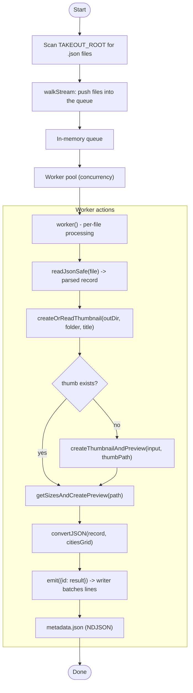

# albums-google-photos-indexer

This repository contains a small indexer that scans a Google Takeout export (JSON files exported per photo), extracts useful metadata, generates cached thumbnails/previews, and writes an NDJSON metadata file for downstream consumption.

**High-level flow**



**What each component does**

- `scripts/indexer.mjs`: orchestrates the run. Loads config, cities, existing metadata, and starts the scanning + workers.
- `scripts/indexer/walkStream.mjs`: traverses directories under `TAKEOUT_ROOT`, finds `.json` files and pushes them into a shared queue. Skips already-indexed ids found in `metadata.json`.
- `scripts/indexer/worker.mjs`: pops items from the queue, reads the JSON, asks for a thumbnail (or uses cache), converts fields, then emits a single-line NDJSON record.
- `scripts/indexer/createOrReadThumbnail.mjs`: checks `TARGET_ROOT/thumbnails` for a cached thumbnail; if missing, creates one using `sharp` and stores it.
- `scripts/indexer/ndjsonToJsonMap.mjs`: maps the input JSON into the simplified output result (id, geo, city lookup, views, folder, social comments, etc.). Uses `cities.json` to find nearest city.
- `scripts/indexer/initOutputDir.mjs`: ensures the output `TARGET_ROOT` and a `thumbnails` cache folder exist, returns a streaming writer that batches NDJSON lines and flushes periodically.

**Example: sample input (per-photo JSON)**

```json
{
  "title": "IMG_20220101_123456",
  "photoTakenTime": { "timestamp": "1641033600" },
  "geoData": { "latitude": 37.7749, "longitude": -122.4194 },
  "imageViews": 42,
  "sharedAlbumComments": [ { "author": "alice", "comment": "Nice!" } ],
  "description": "Golden Gate Bridge",
  "url": "...",
  "appSource": "GOOGLE_PHOTOS",
  "creationTime": "2022-01-01T12:34:56Z"
}
```

**Example: sample output NDJSON line (one JSON object per line)**

```json
{"album::IMG_20220101_123456": {"id":"IMG_20220101_123456","folder":"album","title":"IMG_20220101_123456","latitude":37.7749,"longitude":-122.4194,"city":{"name":"San Francisco","country":"United States"},"views":42,"social":[{"author":"alice","comment":"Nice!"}],"width":2048,"height":1152}}
```

Notes:
- Output keys use the pattern `folder::title` (see `SEPARATOR = '::'` in the code).
- `metadata.json` is written as NDJSON (each line is a single JSON object with the top-level key equal to the record id).

**Configuration & running**

- Example config file: `server-config.json` (used via `--config`):

```json
{
  "TAKEOUT_ROOT": "/path/to/Takeout",
  "TARGET_ROOT": "/path/to/output"
}
```

- Run the indexer (example script in `package.json`):

```bash
npm run indexer:hdd
# or directly:
node scripts/indexer.mjs --config server-config.json
```

**Concurrency and performance**

- Concurrency settings are defined in `scripts/indexer.mjs` (`ssd` vs `hdd` modes). The indexer adjusts the number of worker threads and `sharp` concurrency.
- Thumbnails are cached under `TARGET_ROOT/thumbnails`. The indexer reuses cached thumbnails to avoid reprocessing images.

**Files of interest**

- `scripts/indexer.mjs` (main)
- `scripts/indexer/walkStream.mjs`
- `scripts/indexer/worker.mjs`
- `scripts/indexer/createOrReadThumbnail.mjs`
- `scripts/indexer/ndjsonToJsonMap.mjs`
- `scripts/indexer/initOutputDir.mjs`
- `server-config.json` (example runtime config)

**Troubleshooting**

- If the indexer crashes, check the console output. The script exits with a non-zero code on unhandled exceptions.
- Ensure `TAKEOUT_ROOT` points to the root folder containing Google Takeout photo JSON files.
- Ensure `TARGET_ROOT` is writable; `metadata.json` and `thumbnails/` will be created there.

---

If you'd like, I can also:
- add a small example `server-config.example.json` in the repo,
- add a CLI README section showing how to resume partial runs,
- or run a quick smoke-check (dry-run) against a small sample folder.
