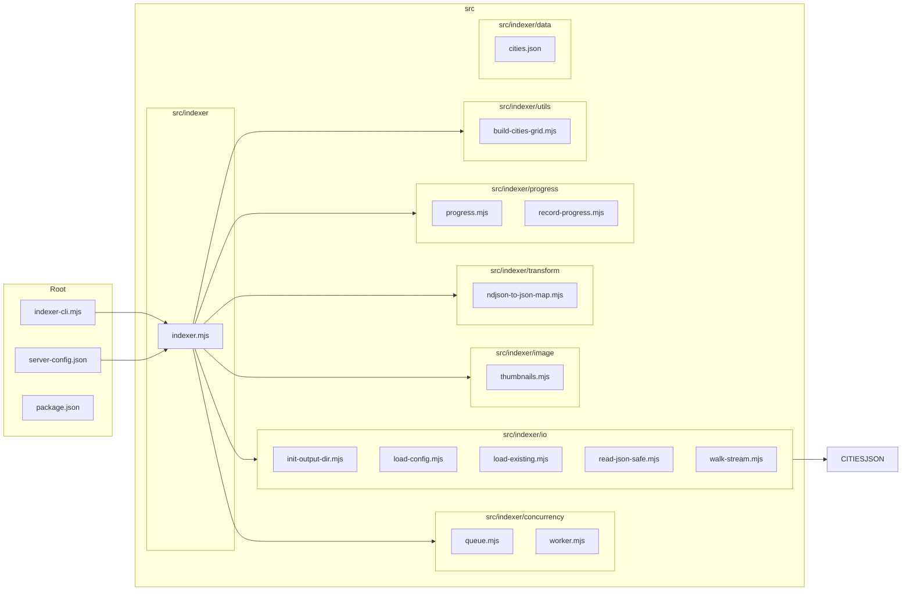

# albums-google-photos-indexer 📸🔎

A small, focused CLI & library for indexing photo albums (Google Photos, local drives) into structured JSON outputs for search, browsing, and offline analysis.

**Overview**

- Purpose: index albums and images, generate JSON/NDJSON maps, produce thumbnails, and track progress for resumable runs.
- Primary entry: `indexer-cli.mjs` — lightweight CLI wrapper that wires configuration to the `src/indexer` implementation.

**Architecture (visual)**



**Folder-by-folder details**

- `src/indexer` — core orchestration and high-level flows.
	- `indexer.mjs`: top-level orchestration. Loads configuration, prepares outputs, composes workers/queues, triggers scanning or API pagination, and delegates transforms and image tasks.

- `src/indexer/concurrency` — job queuing and worker patterns.
	- `queue.mjs`: a lightweight in-memory (or pluggable) queue for tasks with concurrency limits.
	- `worker.mjs`: worker runner that pulls tasks from the queue and executes handlers with retries and backoff.

- `src/indexer/io` — file, config, and streaming IO helpers.
	- `init-output-dir.mjs`: ensures output directory structure, rotates or resumes previous runs.
	- `load-config.mjs`: loads `server-config.json` (or CLI overrides), validates required keys.
	- `load-existing.mjs`: reads previously indexed outputs to avoid re-indexing.
	- `read-json-safe.mjs`: safe JSON reads with graceful error recovery.
	- `walk-stream.mjs`: streaming filesystem walker that emits file entries suitable for pipelining into the queue.

- `src/indexer/image` — image processing utilities.
	- `thumbnails.mjs`: generates thumbnails, supports configurable sizes and formats, writes to output directory.

- `src/indexer/transform` — format transforms and mappers.
	- `ndjson-to-json-map.mjs`: converts NDJSON incremental data into consolidated JSON maps used by frontends/search.

- `src/indexer/progress` — resumability & progress recording.
	- `progress.mjs`: in-memory progress tracker with serialization hooks.
	- `record-progress.mjs`: persists progress checkpoints to disk (and can be extended to remote stores).

- `src/indexer/utils` — helper utilities.
	- `build-cities-grid.mjs`: utility that constructs a spatial grid of cities from `cities.json` for geofencing or UI grouping.

- `src/indexer/data` — static reference data (e.g., `cities.json`).

**What the project does (concise)**

- Indexes photo collections (local or cloud-backed) into structured JSON; produces thumbnails; supports resuming long-running indexing; creates NDJSON/JSON maps for efficient incremental updates and downstream consumption.

**Config examples**

- Minimal `server-config.json` example:

```json
{
	"input": {
		"type": "local",        
		"path": "/mnt/photos"
	},
	"output": {
		"dir": "./out",
		"thumbnails": { "sizes": [200, 400] }
	},
	"concurrency": { "workers": 4 },
	"resume": true
}
```

- Example for a cloud-backed (Google Photos) run (skeleton):

```json
{
	"input": {
		"type": "google-photos",
		"credentialsPath": "./credentials.json",
		"albumFilters": ["family","vacation"]
	},
	"output": { "dir": "./out" },
	"concurrency": { "workers": 8 }
}
```

Note: `credentials.json` should follow the provider's OAuth client format. The project does not store secrets by default — load them from env or mounted files.

**Install & Run**

1. Install dependencies

```bash
npm install
```

2. Quick run (local HDD indexing)

```bash
# uses server-config.json by default
npm run indexer:hdd
```

3. CLI style (node)

```bash
node indexer-cli.mjs --config ./server-config.json
```

4. Resume a run

```bash
node indexer-cli.mjs --config ./server-config.json --resume
```

**Outputs produced**

- `./out/` (configurable): NDJSON incremental files, consolidated JSON maps, thumbnail images, and a `progress.json` checkpoint file.

**Extensions & integrations**

- Google Photos: via provider adapter (expects OAuth credentials) — index albums and mediaItems.
- Local filesystem: streaming walker for directories and mounted drives.
- Pluggable adapters: the IO layer is designed to accept new `input.type` implementations (S3, Dropbox, etc.) with minimal wiring.

**How a user would use this**

1. Prepare `server-config.json` (see examples).
2. Place credentials (if indexing cloud) in a secure path and reference them from config or env.
3. Run `npm run indexer:hdd` or `node indexer-cli.mjs --config ./server-config.json`.
4. After run, consume `./out/*.json` (maps) and `./out/thumbnails` in your frontend or analysis pipeline.

**Developer notes / extensibility**

- Add a new adapter: implement an `input` adapter under `src/indexer/io` that emits a unified event stream consumed by `indexer.mjs`.
- Swap persistence: replace `record-progress.mjs` to persist to a DB rather than disk.

**Helpful commands**

```bash
# list available npm scripts
npm run

# run linter (if configured)
npm run lint
```

**Need more?**

If you'd like, I can also:
- add a small example `server-config.json` in `examples/` and a sample `credentials.json.example` for onboarding
- create a tiny integration test that runs the walker against a fixture directory

— Happy to continue! 🚀

