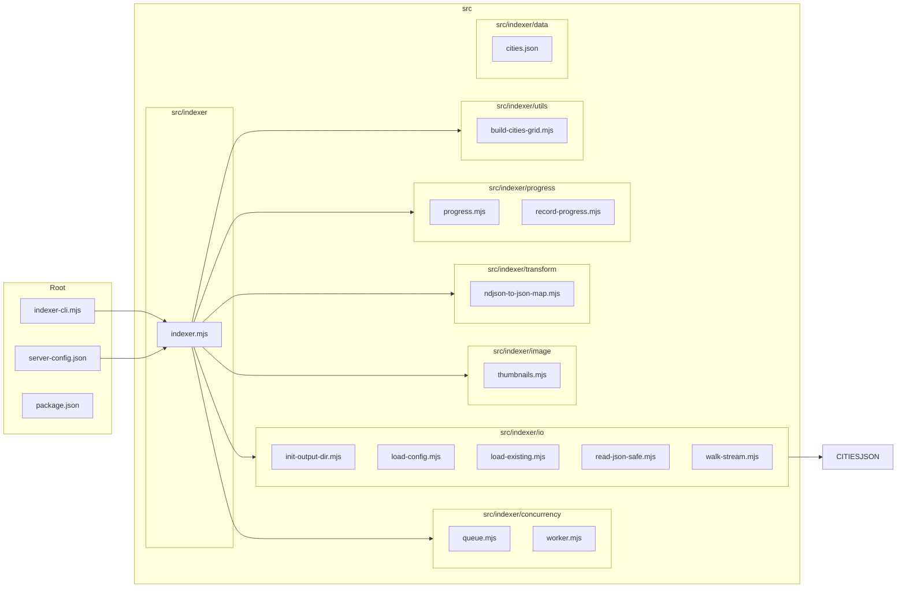

# albums-google-photos-indexer 📸🔎

A small, focused CLI & library for indexing photo albums (local drives) into structured JSON outputs for search, browsing, and offline analysis.

**Overview**

- Purpose: index albums and images, generate JSON/NDJSON maps, produce thumbnails, and track progress for resumable runs.
- Primary entry: `indexer-cli.mjs` — lightweight CLI wrapper that wires configuration to the `src/indexer` implementation.

**Architecture (visual)**



**Folder-by-folder details**

- `src/indexer` — core orchestration and high-level flows.
	- `indexer.mjs`: top-level orchestration. Loads configuration, prepares outputs, composes workers/queues, triggers scanning or API pagination, and delegates transforms and image tasks.

- `src/indexer/concurrency` — job queuing and worker patterns.
	- `queue.mjs`: a lightweight in-memory (or pluggable) queue for tasks with concurrency limits.
	- `worker.mjs`: worker runner that pulls tasks from the queue and executes handlers with retries and backoff.

- `src/indexer/io` — file, config, and streaming IO helpers.
	- `init-output-dir.mjs`: ensures output directory structure, rotates or resumes previous runs.
	- `load-config.mjs`: loads `server-config.json` (or CLI overrides), validates required keys.
	- `load-existing.mjs`: reads previously indexed outputs to avoid re-indexing.
	- `read-json-safe.mjs`: safe JSON reads with graceful error recovery.
	- `walk-stream.mjs`: streaming filesystem walker that emits file entries suitable for pipelining into the queue.

- `src/indexer/image` — image processing utilities.
	- `thumbnails.mjs`: generates thumbnails, supports configurable sizes and formats, writes to output directory.

- `src/indexer/transform` — format transforms and mappers.
	- `ndjson-to-json-map.mjs`: converts NDJSON incremental data into consolidated JSON maps used by frontends/search.

- `src/indexer/progress` — resumability & progress recording.
	- `progress.mjs`: in-memory progress tracker with serialization hooks.
	- `record-progress.mjs`: persists progress checkpoints to disk (and can be extended to remote stores).

- `src/indexer/utils` — helper utilities.
	- `build-cities-grid.mjs`: utility that constructs a spatial grid of cities from `cities.json` for geofencing or UI grouping.

- `src/indexer/data` — static reference data (e.g., `cities.json`).

**What the project does (concise)**

- Indexes local photo collections into structured JSON; produces thumbnails; supports resuming long-running indexing; creates NDJSON/JSON maps for efficient incremental updates and downstream consumption.


**Config examples**

- Example config file: [examples/server-config.json](examples/server-config.json)

You can re-use the provided example directly. A minimal snippet from that file:

```json
{
  "TAKEOUT_ROOT": "/mnt/.../Takeout || C:\\...\\Takeout",
  "TARGET_ROOT": "/mnt/.../cache || C:\\...\\cache"

}
```

Note: This edition focuses on local filesystem indexing. The IO layer is pluggable so new adapters (S3, cloud APIs) can be added later, but there is no cloud-backed adapter included in this repository.

**Install & Run**

1. Install dependencies for development

```bash
npm install
```

2. Quick run (local HDD indexing)

```bash
# uses server-config.json by default
npm run indexer
```

3. Run the REST server

```bash
# starts Express on port 3000 and remains idle until POST /on
npm start

# use a different port
PORT=8080 npm start

# use a different config
node server.mjs --config ./examples/server-config.json
```

The server controls the indexer in the same Node.js process. It does not spawn a
separate indexer process. Configuration is loaded from the file passed with
`--config`, and the server listens on `PORT` or port `3000` by default.

`npm start` builds `dist/server.mjs` before launching it. The server bundle
contains Express, the indexer, and sharp's JavaScript layer in one artifact.
Sharp's current-platform native packages remain bundled with the npm package so
the native image processing bindings are available at runtime.

Available endpoints:

- `GET /status` returns the current lifecycle state and progress.
- `POST /on` starts indexing and returns `202`. Calling it while indexing is
	already running is idempotent.
- `POST /off` requests a cooperative stop. Calling it when indexing is not
	running is also idempotent.
- `GET /file` returns the configured `TARGET_ROOT/metadata.json`. It returns
	`404` until the output file exists.

The output file is written incrementally, so clients should use `/status` to
determine whether indexing has finished before consuming the complete file.

4. CLI style (node)

```bash
# use the example config shipped with the repo
node indexer-cli.mjs --config ./examples/server-config.json
```

5. Install as a dependency in another project

- From the npm registry (when published):

```bash
npm install albums-google-photos-indexer
```

- Directly from this GitHub repository:

```bash
npm install github:travel-albums-ai/albums-google-photos-indexer
```

- For local development / testing from a sibling folder:

```bash
npm install ../albums-google-photos-indexer
# or
npm link ../albums-google-photos-indexer
```

6. Run the CLI from another project

- Using `npx` (runs the published `indexer` binary or the package from the registry):

```bash
npx indexer --config ./node_modules/albums-google-photos-indexer/examples/server-config.json
```

- Spawn the binary programmatically from a script:

```javascript
import { spawn } from 'node:child_process';
const p = spawn('npx', ['indexer', '--config', './node_modules/albums-google-photos-indexer/examples/server-config.json'], { stdio: 'inherit' });
await new Promise((r, j) => p.on('close', r));
```

6. Install via tarball (pack + install)

```bash
# from this package folder
npm pack
# then in the other project
npm install ../albums-google-photos-indexer/albums-google-photos-indexer-0.0.3.tgz
```

**Outputs produced**

- `./out/` (configurable): NDJSON incremental files, consolidated JSON maps, thumbnail images, and a `progress.json` checkpoint file.

**Extensions & integrations**

- Local filesystem: streaming walker for directories and mounted drives (built-in).
- Pluggable adapters: the IO layer is designed to accept new `input.type` implementations (S3, Dropbox, cloud APIs) with minimal wiring. Note: cloud adapters are not included in this edition.

**How a user would use this**

1. Prepare `server-config.json` (see examples).
2. Place credentials (if indexing cloud) in a secure path and reference them from config or env.
3. Run `npm run indexer:hdd` or `node indexer-cli.mjs --config ./server-config.json`.
4. After run, consume `./out/*.json` (maps) and `./out/thumbnails` in your frontend or analysis pipeline.

**Programmatic usage**

You can import and control the indexer from other Node modules. The package exports a default `start()` helper, named `start` and `stop` exports, and an `IndexerController` class. `start()` returns a controller whose `done` property is a promise and which exposes a `stop()` method.

Quick example (from another project):

```javascript
import start, { stop as stopGlobal } from 'albums-google-photos-indexer';

// start programmatically with an explicit config
const controller = start({ cfg: { TAKEOUT_ROOTS: ['.'], TARGET_ROOT: './.test-output' } });

// stop via the returned handle
setTimeout(() => controller.stop(), 200);

// or use the global stop helper
setTimeout(() => stopGlobal(), 200);

await controller.done; // resolves when indexing finishes or is stopped
```

Importing specific internal modules

If you need to import lower-level helpers from the repository (for example to reuse `walkStream` or `initOutputDir`), the package exports the source files under the `./src/*` export mapping:

```javascript
import { walkStream } from 'albums-google-photos-indexer/src/indexer/io/walk-stream.mjs';
```

Notes

- This package is ESM-only (`"type": "module"` in `package.json`), and requires Node.js >= 18.
- When using the installed package, you can run the bundled CLI binary via `npx indexer` (the package provides a `bin` entry).
- See the example programmatic runner in [examples/programmatic.mjs](examples/programmatic.mjs) for a runnable demo.

**Developer notes / extensibility**

- Add a new adapter: implement an `input` adapter under `src/indexer/io` that emits a unified event stream consumed by `indexer.mjs`.
- Swap persistence: replace `record-progress.mjs` to persist to a DB rather than disk.

**Helpful commands**

```bash
# list available npm scripts
npm run

# run linter (if configured)
npm run lint
```
